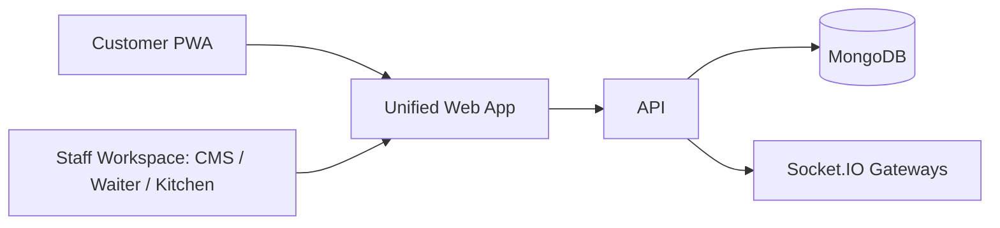

# Architecture

The active runtime has two Node.js applications: `apps/api` and `apps/web`.

- `apps/api` owns REST APIs and in-process Socket.IO realtime.
- `apps/web` owns the unified staff workspace and public customer QR/PWA flows.
- `packages/shared` owns shared roles, permissions, event names, and contracts.
