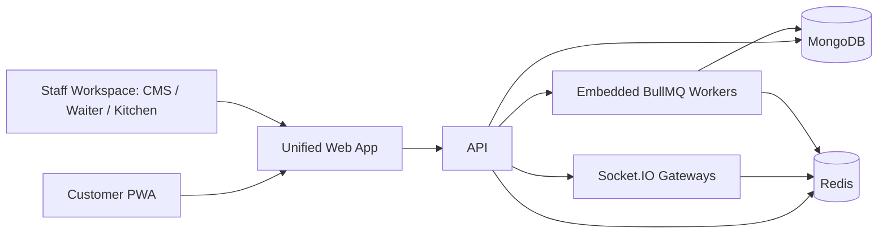

# Architecture

The active runtime has two Node.js applications: `apps/api` and `apps/web`.

- `apps/api` owns REST APIs, Socket.IO realtime, and embedded BullMQ workers.
- `apps/web` owns the unified staff workspace and public customer QR/PWA flows.
- `packages/shared` owns shared roles, permissions, event names, and contracts.
- `apps/realtime`, `apps/worker`, `apps/waiter`, and `apps/kitchen` remain in GitHub as archived reference code only.
