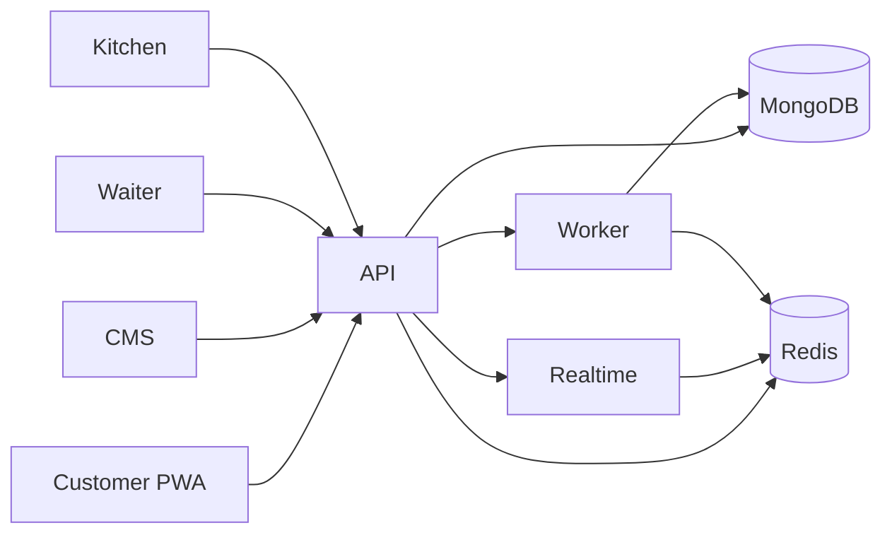

# Architecture

```mermaid
flowchart LR
  CustomerPWA[Customer PWA] --> API
  CMS[CMS] --> API
  Waiter --> API
  Kitchen --> API
  API --> Mongo[(MongoDB)]
  API --> Redis[(Redis)]
  API --> Realtime
  API --> Worker
  Realtime --> Redis
  Worker --> Redis
  Worker --> Mongo
```

The architecture keeps transactional writes in the API, fanout in the realtime service, and slow or retried work inside BullMQ workers.

