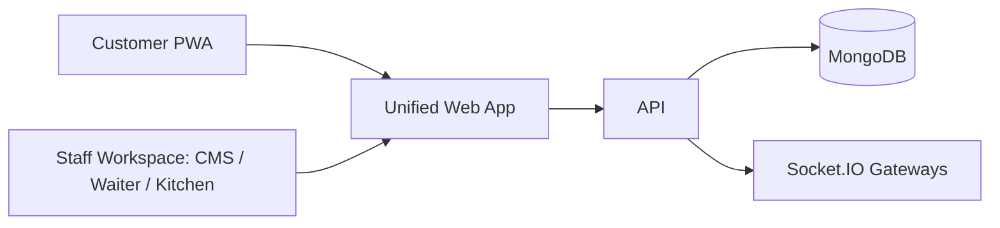

# Architecture

```mermaid
flowchart LR
  CustomerPWA[Customer PWA] --> Web[Unified Web App]
  Staff[Staff Workspace: CMS / Waiter / Kitchen] --> Web
  Web --> API
  API --> Mongo[(MongoDB)]
  API --> SocketIO[Socket.IO Gateways]
```

The active runtime has two Node.js applications: `apps/api` and `apps/web`.

- `apps/api` owns REST APIs and in-process Socket.IO realtime.
- `apps/web` owns the unified staff workspace and public customer QR/PWA flows.
- `packages/shared` owns shared roles, the screen permission registry, plan
  entitlement defaults, event names, and API contracts.

Two global infrastructure modules sit in front of the feature modules:

- `infrastructure/access` resolves a caller's effective permissions for a given
  outlet and authorises every tenant/branch-scoped record.
- `infrastructure/entitlements` resolves what a tenant's subscription allows and
  refuses creates that would exceed it.

Both are `@Global()`, read only local MongoDB, and cache in process. See
[permissions.md](permissions.md).
