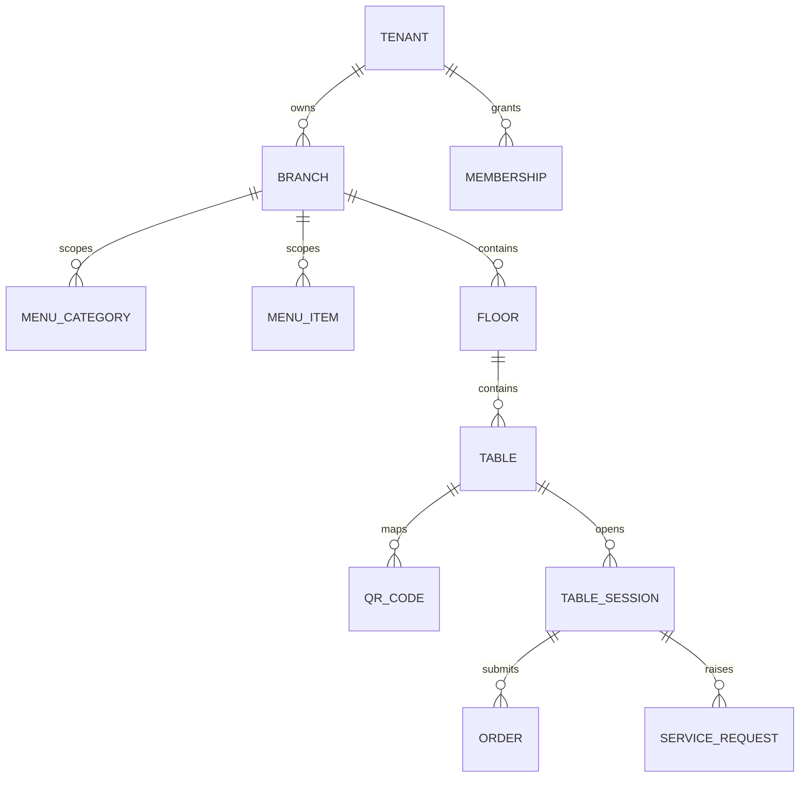

# Data Model

- `menu_categories` embeds subcategories.
- `menu_items` embeds variants, add-on groups, schedules, and branch overrides.
- `table_sessions` embeds participants and the mutable shared bucket.
- `orders` embed immutable snapshots of items and add-ons.

