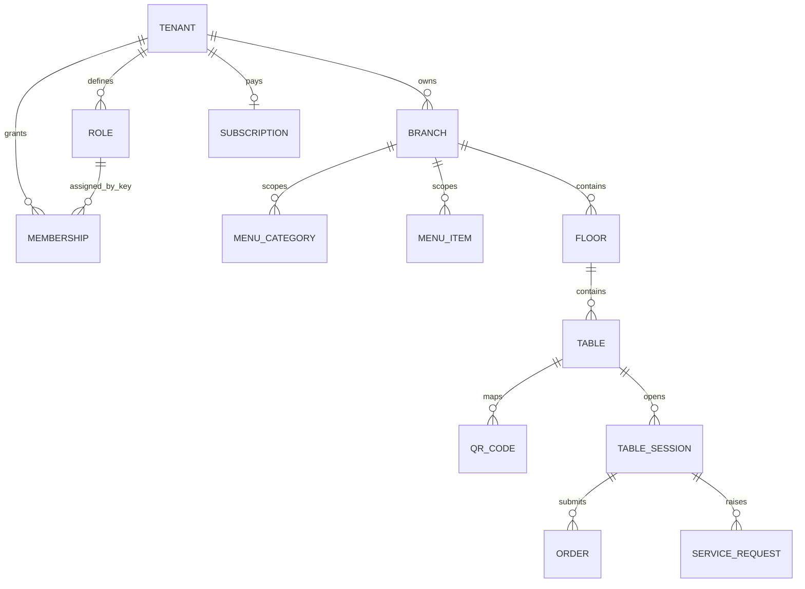

# Data Model

```mermaid
erDiagram
  TENANT ||--o{ BRANCH : owns
  TENANT ||--o{ MEMBERSHIP : grants
  TENANT ||--o{ ROLE : defines
  ROLE ||--o{ MEMBERSHIP : assigned_by_key
  TENANT ||--o| SUBSCRIPTION : pays
  BRANCH ||--o{ MENU_CATEGORY : scopes
  BRANCH ||--o{ MENU_ITEM : scopes
  BRANCH ||--o{ FLOOR : contains
  FLOOR ||--o{ TABLE : contains
  TABLE ||--o{ QR_CODE : maps
  TABLE ||--o{ TABLE_SESSION : opens
  TABLE_SESSION ||--o{ ORDER : submits
  TABLE_SESSION ||--o{ SERVICE_REQUEST : raises
```

- `menu_categories` embeds subcategories.
- `menu_items` embeds variants, add-on groups, schedules, and branch overrides.
- `table_sessions` embeds participants and the mutable shared bucket.
- `orders` embed immutable snapshots of items and add-ons.
- `roles` holds tenant-defined roles. Built-in roles are **not** stored here —
  they live in code so a permission change ships without a backfill.
- `memberships.role` is a plain string: a built-in role value or a tenant role's
  `key`. It is deliberately not a schema enum, because tenant keys are unbounded.
  One user can hold a different role at each outlet; the unique index is
  `(tenantId, userId, branchId)`.
- `branches.status` is `active` or `archived`. Outlets are archived, never hard
  deleted, because orders, payments, tables, floors, menus, and memberships all
  carry a `branchId`. Archived outlets stop counting toward the plan's cap.
- `tenants.entitlementOverrides` holds per-tenant plan overrides for custom
  deals; absent keys inherit from the plan.
- `subscription_plans` carries the numeric caps and feature flags a plan grants.

See [permissions.md](permissions.md) for how roles and entitlements resolve.

