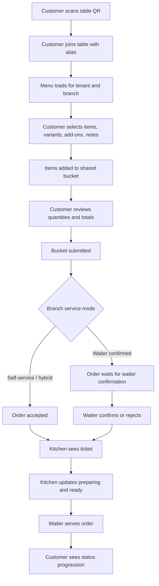
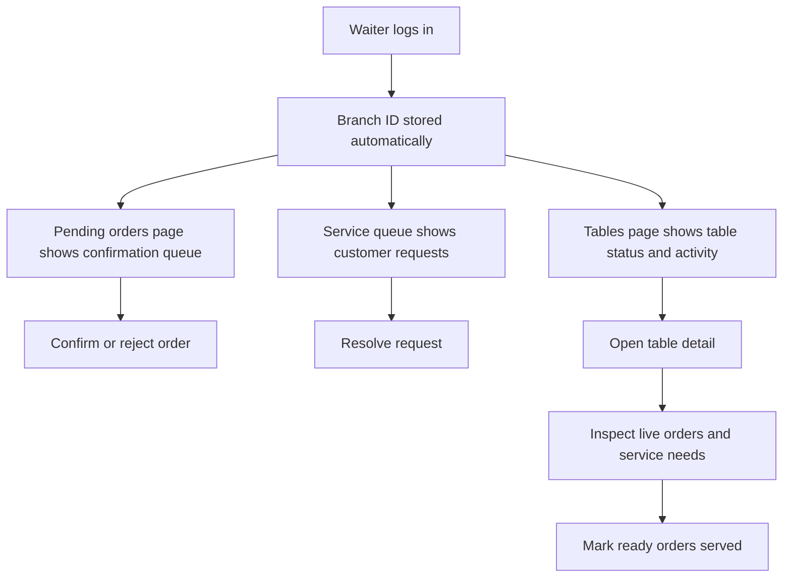
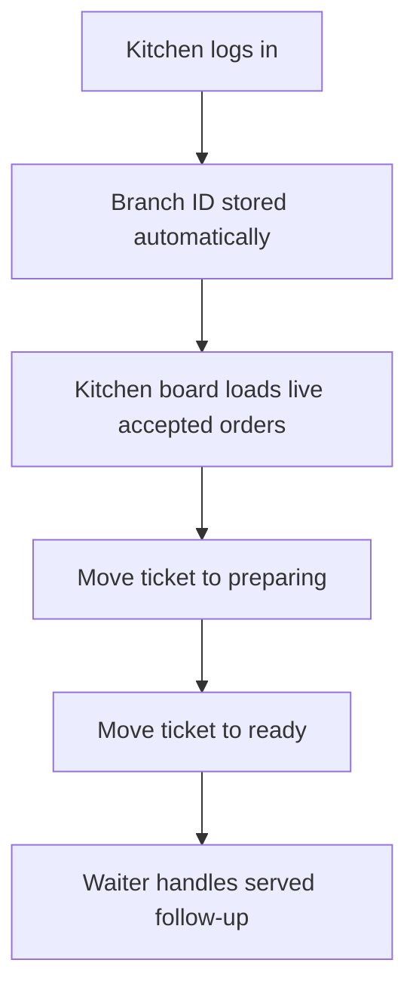
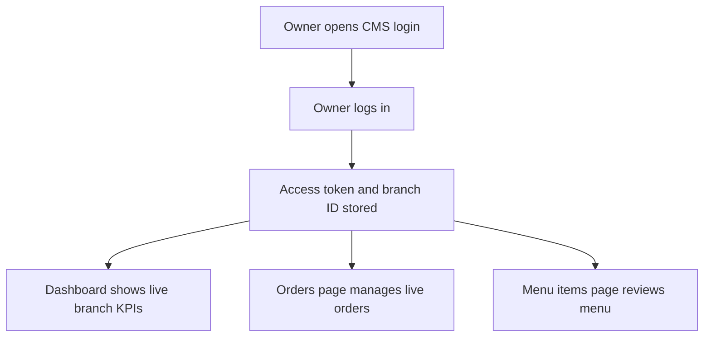
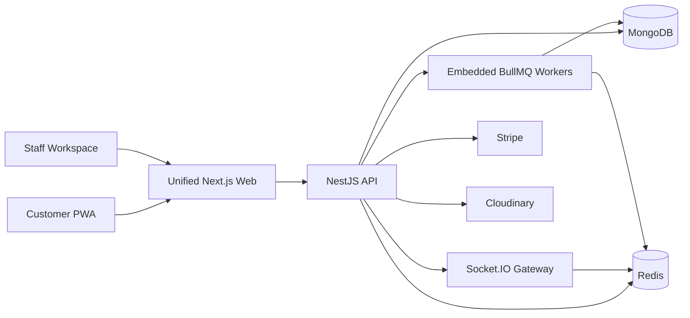
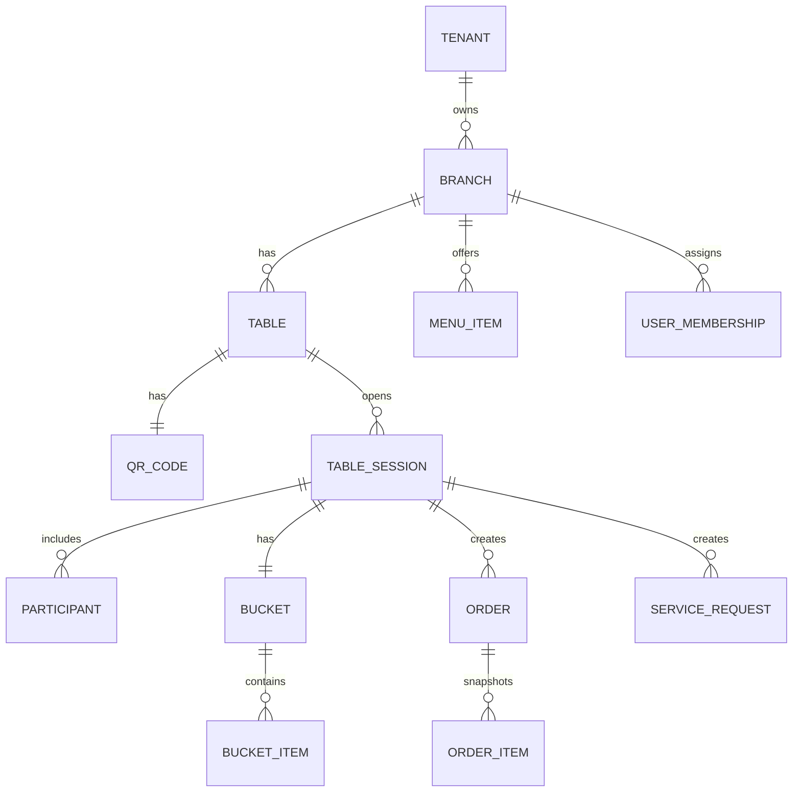

# Restaurent SaaS Project Overview

This document explains the Restaurent project for both non-technical and technical audiences. It is designed as a presentation-ready guide: start from the business idea, understand the user flows, then go deeper into architecture, apps, APIs, data, and local demo usage.

## 1. Executive Summary

Restaurent is a multi-tenant restaurant operating platform. It helps restaurants manage dine-in QR ordering, menu operations, waiter workflows, kitchen order progression, billing follow-up, and owner/admin visibility from one connected system.

In simple terms:

- Customers scan a table QR code, join the table, browse the menu, add food to a shared bucket, submit an order, and track status.
- Waiters see pending orders, table activity, ready food, and customer service requests.
- Kitchen staff see live tickets and move them through accepted, preparing, ready, and served states.
- Owners and managers use the CMS to view branch activity, live orders, and menu items.
- The backend keeps the restaurant data consistent, secure, and branch-aware.

The project is built as a monorepo with two active apps plus shared domain code. `apps/api` runs REST APIs, Socket.IO realtime, and embedded BullMQ workers. `apps/web` runs the unified Next.js frontend for the CMS, waiter, kitchen, billing, and customer QR/PWA routes. The old `apps/realtime`, `apps/worker`, `apps/waiter`, and `apps/kitchen` folders remain only as archived reference code.

## 2. Who Uses The System

| User | What They Need | App / Surface |
| --- | --- | --- |
| Customer | Scan QR, browse menu, create order, track food | Customer PWA in `apps/web` under `/r/...` |
| Waiter | Confirm orders, monitor tables, resolve requests, mark served | Staff workspace in `apps/web` |
| Kitchen | See tickets and update preparation status | Kitchen board in `apps/web` |
| Owner / Manager | View dashboard, live orders, menu items, branch operations | Staff workspace in `apps/web` |
| Platform/Admin | Seed, manage tenants, plans, integrations | API/scripts/admin tooling |

## 3. Product Flow

### Customer Ordering Flow



### Waiter Flow



### Kitchen Flow



### Owner / CMS Flow



## 4. Apps And Responsibilities

| App / Package | Technology | Responsibility |
| --- | --- | --- |
| `apps/web` | Next.js | Unified frontend for CMS, waiter, kitchen, billing, and customer QR/PWA flow |
| `apps/api` | NestJS | Auth, menu, tables, QR, sessions, buckets, orders, service requests, billing, webhooks, Socket.IO, and embedded workers |
| `packages/shared` | TypeScript | Shared enums, API contracts, route constants, permissions, event names |
| `scripts` | TypeScript/shell | Seed, admin creation, migrations, local verification |
| `apps/realtime`, `apps/worker`, `apps/waiter`, `apps/kitchen` | Mixed | Archived reference code only; not active build, script, or deploy targets |

## 5. Technical Architecture



The API is the source of truth for transactional operations. Socket.IO runs on the API origin under `/socket.io`, and embedded workers process slower or retried jobs such as notifications, cleanup, billing reconciliation, analytics, and media cleanup when `EMBEDDED_WORKERS=true`.

## 6. Main Backend Domains

| Domain | What It Handles |
| --- | --- |
| Auth | Staff login, refresh, logout, current user |
| Tenants and branches | Multi-tenant restaurant structure |
| Tables and QR | Table list, table creation, QR tokens, QR regeneration |
| Guest sessions | Customer join flow and guest JWTs |
| Buckets | Shared table bucket, add/update/remove item, submit order |
| Menu | Public menu, CMS menu categories/items |
| Orders | Live orders, detail, confirmation, rejection, status updates |
| Service requests | Customer requests and waiter resolution |
| Analytics | Branch overview and menu analytics |
| Billing | Stripe checkout and customer portal |
| Media | Signed uploads for menu media |
| Webhooks | Stripe webhook processing |

## 7. Important API Families

Base API path: `/api/v1`

| Endpoint Family | Example | Purpose |
| --- | --- | --- |
| Auth | `POST /auth/login` | Staff login |
| Public context | `GET /public/table-context?qrToken=qr-t1` | Resolve QR token into tenant, branch, table, and session context |
| Public order status | `GET /public/orders/:id/status?qrToken=...` | Customer-safe order status lookup |
| Menu | `GET /menu?tenantId=...&branchId=...` | Customer menu loading |
| Buckets | `POST /buckets/:tableSessionId/items` | Add customer item |
| Buckets | `POST /buckets/:tableSessionId/submit` | Submit order with idempotency |
| Orders | `GET /orders/live?branchId=...` | Staff live order queue |
| Orders | `POST /orders/:id/confirm` | Waiter confirms order |
| Orders | `PATCH /orders/:id/status` | Kitchen/waiter status update |
| Service requests | `GET /service-requests?branchId=...` | Waiter service queue |
| CMS tables | `GET /cms/tables?branchId=...` | Branch table list |
| CMS menu | `GET /cms/menu/items?branchId=...` | Branch menu item list |

## 8. Key Data Model Concepts



Important ideas:

- A tenant is a restaurant business.
- A branch is a specific location.
- A table has a QR code.
- A table session begins when customers join through a QR.
- A bucket is the shared draft order for the table.
- An order is an immutable snapshot created when the bucket is submitted.
- Staff users work inside tenant/branch memberships.

## 9. Current Demo Data

The seed script creates a sample restaurant:

| Item | Value |
| --- | --- |
| Tenant slug | `harbor-grill` |
| Branch slug | `downtown` |
| Customer QR URL | `http://localhost:3000/r/harbor-grill/downtown/t/qr-t1` |
| Other QR tokens | `qr-t2`, `qr-t3`, `qr-t4`, `qr-t5` |

Seeded users:

| Role | Email | Password | App |
| --- | --- | --- | --- |
| Owner | `owner@harborgrill.test` | `OwnerPass123!` | `http://localhost:3000/login` |
| Waiter | `waiter@harborgrill.test` | `WaiterPass123!` | `http://localhost:3000/login` |
| Kitchen | `kitchen@harborgrill.test` | `KitchenPass123!` | `http://localhost:3000/login` |
| Platform admin | `platform@example.com` | from `.env` or `ChangeMe123!` | Admin tooling |

For owner, waiter, kitchen, manager, and cashier login, Branch ID can be left blank for the seeded single-branch account. The login response returns the branch ID and role, and the unified frontend stores them automatically.

## 10. Local Running URLs

| Service | URL |
| --- | --- |
| Web / CMS / Customer PWA | `http://localhost:3000` |
| API health | `http://localhost:4000/api/v1/health` |
| Realtime gateway | `http://localhost:4000` |
| Staff dashboard | `http://localhost:3000/dashboard` |
| Kitchen board | `http://localhost:3000/kitchen-board` |
| Bills | `http://localhost:3000/bills` |

### Running On Your Wi-Fi / Router

For demos on real devices, replace `localhost` with your computer's local network IP address.

Example:

| Service | LAN URL example |
| --- | --- |
| Web / CMS / Customer PWA | `http://192.168.1.45:3000` |
| Customer QR demo | `http://192.168.1.45:3000/r/harbor-grill/downtown/t/qr-t1` |
| Staff dashboard | `http://192.168.1.45:3000/dashboard` |
| Kitchen board | `http://192.168.1.45:3000/kitchen-board` |
| API health | `http://192.168.1.45:4000/api/v1/health` |

How to find the IP on Windows:

```powershell
Get-NetIPAddress -AddressFamily IPv4 |
  Where-Object { $_.IPAddress -like "192.168.*" -or $_.IPAddress -like "10.*" } |
  Select-Object IPAddress
```

Router demo rules:

- The computer running the project and the phone/tablet must be on the same Wi-Fi/router.
- Use the computer IP, not `localhost`, on external devices.
- The frontend rewrites local API and realtime URLs to the LAN hostname when opened from the router IP.
- The API allows private-network development origins.
- Windows Firewall may need to allow Node.js on ports `3000` and `4000`.

Common commands:

```bash
npm install
npm run seed
npm run dev
```

Quality checks:

```bash
npm run lint
npm run typecheck
npm run build
npm run test
```

## 11. What Is Implemented Now

Customer:

- QR context loading
- Join table with alias
- Public menu loading
- Item variants, add-ons, quantity, notes
- Shared bucket review
- Submit order
- Status tracking

Waiter:

- Login
- Auto branch storage
- Table dashboard with table status and QR token
- Pending order confirmation/rejection
- Service queue with resolve action
- Table detail view
- Ready order served follow-up

Kitchen:

- Login
- Auto branch storage
- Live board grouped by order status
- Status progression from accepted to preparing, ready, served

CMS:

- Owner login
- Dashboard live KPIs
- Live order management
- Menu item list/review

API:

- Auth
- Public QR context
- Customer bucket/order flow
- Staff order workflow
- Service request list/resolve
- CMS table/menu APIs
- Billing/media/webhook foundations

## 12. Known Gaps And Future Improvements

The current project is an MVP foundation. The next practical improvements are:

- Replace manual/token-style CMS controls fully with protected routes and auth-aware layouts.
- Expand realtime coverage on customer and staff screens while keeping polling fallbacks for resilience.
- Add full CMS menu item create/edit forms.
- Add table-session detail API for richer waiter table detail views.
- Add full bill/payment lifecycle and cashier workflow.
- Add more focused end-to-end coverage for role-based staff workflows.
- Add stronger automated end-to-end tests with seeded local services.
- Add production monitoring, structured logging, and deployment-specific environment hardening.

## 13. How To Present This Project

For non-technical audiences:

- Start with the customer story: scan QR, order, track food.
- Then explain staff impact: waiter and kitchen receive structured work instead of verbal chaos.
- Then explain owner value: visibility into live operations and menu control.
- Avoid code details unless asked.

For technical audiences:

- Start with the monorepo structure.
- Explain the API as source of truth.
- Explain MongoDB entities: tenant, branch, table, session, bucket, order.
- Explain JWT auth separation between guest and staff.
- Explain why order submission uses idempotency.
- Explain realtime updates through Socket.IO rooms on the API origin.

## 14. One-Minute Pitch

Restaurent is a restaurant operations platform that connects the customer table, waiter floor, kitchen station, and owner dashboard. Customers scan a QR code and order from their table. Waiters confirm orders and handle service requests. Kitchen staff process live tickets. Owners see branch activity and manage menu data. The system is multi-tenant, branch-aware, and built with a NestJS API, MongoDB, Redis-backed realtime and queue infrastructure, and one unified Next.js frontend.
